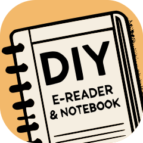

# DIY Notebook - Hack your E-Reader, Make reading and journaling a one-stop shop

Welcome to the DIY Notebook project! This project is designed to collect resources around portable literacy and help you create a combined e-reader and physical notebook, enhancing your reading and journaling experiences by merging digital and physical mediums into one portable device.

<!-- Download guide as PDF: [DIY Notebook Guide](2024_DIYNotebook.pdf) -->

## Overview

This project aims to:

- Improve accessibility for both reading and writing on the go.
- Encourage mindful, distraction-free activities.
- Provide a portable, lightweight solution for combining an e-reader and notebook.

## Materials Needed

- **Notebooks**: A6 size (10x14cm)
  - 60 pages (lightweight and thin)
  - 160 pages (more features)
  - 80 pages (untested, not compatible with all cases)
- **Attachment Methods**:
  - Duct tape (lightweight and thin)
  - Velcro tape (detachable, less waste)
  - Glue-in magnets (fancy but adds weight, needs more testing)
- **E-reader**: Kindle or similar device

## Step-by-Step Guide

### 1. Purchase Notebooks

Choose an A6-sized notebook with dimensions of 10x14cm. You have three options:
- **60 pages**: Lightweight and thin.
- **160 pages**: More features.
- **80 pages**: Untested and not compatible with all cases.

### 2. Put It Together

Select one of the following materials to attach your notebook to your e-reader:
- **Duct tape**: Lightweight and thin.
- **Velcro tape**: Detachable and creates less waste.
- **Glue-in magnets**: Fancy but adds weight and needs more testing.

### 3. Enjoy Reading and Journaling on the Go

Combine the notebook and e-reader for a unified, portable, and distraction-free experience.

## How to Share Your Design

We would love to see your creations! Share your design on social media with the hashtag #DIYNotebook

More hashtag ideas to spread the awareness:
- #EReaderHack
- #ReadingAndWriting
- #JournalingOnTheGo
- #DigitalDetox
- #PortableLiteracy
- #CreativeDesign
- #ProductivityHacks
- #ReadingHabit
- #TravelWithBooks
- #TechAndPaper

## Contributing

If you have any ideas, suggestions, or improvements, feel free to contribute to this project. Please fork the repository and submit a pull request with your changes.

## License

This project is licensed under the MIT License. See the [LICENSE](LICENSE) file for details.

---

**Happy reading and journaling!**

*Created by Phil Wornath*
