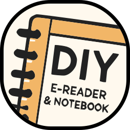
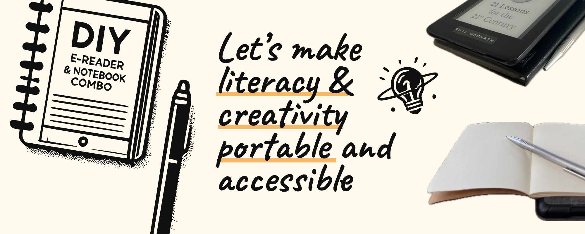

# DIY Notebook - Hack your E-Reader, Make reading and journaling a one-stop shop

Welcome to the DIY Notebook project! This project is designed to collect resources around portable literacy and help you create a combined e-reader and physical notebook, enhancing your reading and journaling experiences by merging digital and physical mediums into one portable device.

As a UX Designer, I often get bored by digital products that sometimes are only created to distract from the real world - or make us buy more physical products more easily.

As a designer, I want to create meaningful experiences, stimulate good habits, and act resourcefully aligned with our environment.

My issues were that I needed a better trigger to start reading and journaling - making both activities as accessible as my phone. So I combined my e-reader with a physical notebook - a one-stop shop for reading and journaling.
A super simple hack - but people kept on asking me about it - so I decided to share it with you.

This project shows that sometimes the best solution is a combination of calm technology and analog products - and that we can create them ourselves.

It is an idea, a framework - not a polished product. But the IKEA effect shows: We enjoy building things ourselves anyway. It works for me - and I hope it works for you - and maybe there is an industrial designer who wants to collaborate on a more polished version.

Let me know what you think - and shape reading and journaling habits globally - let's work against digital distraction and for a more mindful and sustainable future.

## Overview

This project aims to:

- Improve accessibility for both reading and writing on the go.
- Encourage mindful, distraction-free activities.
- Provide a portable, lightweight solution for combining an e-reader and notebook.

## Materials Compatibility

| Material        | Compatibility Score | Pros                                | Cons                              |
|-----------------|:-------------------:|-------------------------------------|-----------------------------------|
| **Notebooks**   |                     |                                     |                                   |
| A6 / 60 pages   | 🟢 100%             | Lightweight & Thin                  |                                   |
| A6 / 160 pages  | 🟢 90%              | More Features                       | Slightly heavier                  |
| A6 / 80 pages   | 🟠 50%              | Untested                            | Not compatible with all cases     |
| **Attachment**  |                     |                                     |                                   |
| Duct tape       | 🟢 100%             | Lightweight & Thin                  |                                   |
| Velcro tape     | 🟢 90%              | Detachable & Less Waste             | Slightly bulkier                  |
| Glue-in magnets | 🟠 50%              | Fancy                               | Adds weight, needs more testing   |

Feel free to experiment with different materials and combinations, find the best solution for your needs and create a pull request.

## How to Share Your Design

We would love to see your creations! Share your design on social media with the hashtag #DIYNotebook

More hashtag ideas to spread the awareness:
- #EReaderHack
- #ReadingAndWriting
- #JournalingOnTheGo
- #DigitalDetox
- #PortableLiteracy
- #CreativeDesign
- #ProductivityHacks
- #ReadingHabit
- #TravelWithBooks
- #TechAndPaper

## Contributing

If you have any ideas, suggestions, or improvements, feel free to contribute to this project. Please fork the repository and submit a pull request with your changes.

## License

This project is licensed under the MIT License. See the [LICENSE](LICENSE) file for details.

---

**Happy reading and journaling!**

*Created by Phil Wornath*
